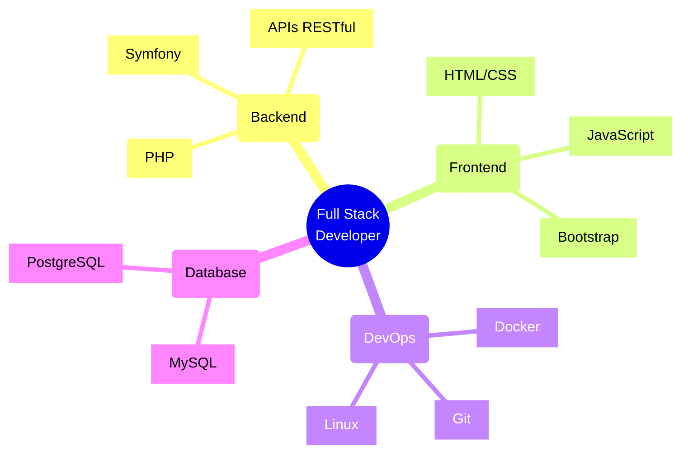

<div align="center">
  
# ⚡️ Tobias Stanislavsky
  
[](https://git.io/typing-svg)

<p>
  <a href="https://linkedin.com/in/tobias-stanislavsky-14641a22b"></a>
  <a href="mailto:stanislavskytobias@gmail.com"></a>
</p>

</div>

## 🚀 Sobre mí 

> *"La programación es el arte de crear soluciones elegantes para problemas complejos"*

Soy un desarrollador Full Stack apasionado por crear aplicaciones web eficientes y escalables. Mi especialidad es el desarrollo con PHP y Symfony, siempre enfocado en implementar las mejores prácticas y patrones de diseño.

- 🔭 Especializado en desarrollo Full Stack con PHP y Symfony
- 📚 Constantemente aprendiendo nuevas tecnologías
- 👥 Creo firmemente en el poder del trabajo en equipo
- 🌱 Comprometido con el crecimiento profesional y personal
- 💡 Apasionado por compartir conocimientos

## 💻 Stack Tecnológico

<details>
<summary>📋 Lenguajes</summary>

```javascript
const languages = {
    backend: ['PHP', 'Python', 'Java', 'C'],
    frontend: ['JavaScript', 'HTML5', 'CSS3', 'Sass'],
    focus: 'Siempre aprendiendo nuevas tecnologías'
}
```

</details>

<details>
<summary>🛠️ Frameworks & Herramientas</summary>

<div align="center">

| Frameworks | Herramientas | DevOps |
|------------|-------------|---------|
|  |  |  |
|  |  |  |

</div>
</details>

## 📊 Estadísticas

<div align="center">

<a href="https://next.ossinsight.io/widgets/official/compose-user-dashboard-stats?user_id=94922759" target="_blank">
  <picture>
    <source media="(prefers-color-scheme: dark)" srcset="https://next.ossinsight.io/widgets/official/compose-user-dashboard-stats/thumbnail.png?user_id=94922759&image_size=auto&color_scheme=dark">
    
  </picture>
</a>


</div>

## ⚡ Contribuciones y Actividad

<div align="center">


<details>
<summary>🌟 Logros Destacados</summary>

| 🏆 Logros | 🎯 Metas 2024 |
|-----------|---------------|
| Desarrollo de aplicaciones web con Symfony | Dominar Docker y CI/CD |
| Implementación de arquitecturas escalables | Contribuir a proyectos open source |
| Integración de sistemas complejos | Aprender nuevos frameworks |
| Optimización de rendimiento en PHP | Especialización en Cloud Computing |

</details>

</div>

## 🎯 Áreas de Especialización



## 📫 Conectemos

<div align="center">
  
<a href="https://www.linkedin.com/in/tobias-stanislavsky">
  
</a>
<a href="mailto:stanislavskytobias@gmail.com">
  
</a>

### 💬 Encuéntrame en línea

```typescript
const contactInfo = {
    linkedin: "linkedin.com/in/tobias-stanislavsky",
    email: "stanislavskytobias@gmail.com",
    disponible_para: [
        "Nuevas oportunidades",
        "Colaboraciones",
        "Proyectos open source",
        "Networking"
    ]
}
```

</div>

[El resto del README permanece igual]

---

<div align="center">
  
### 👨‍💻 Visitantes


</div>
